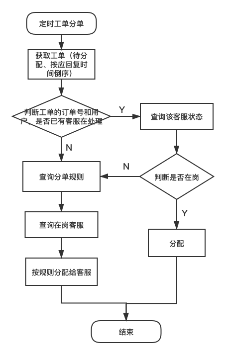
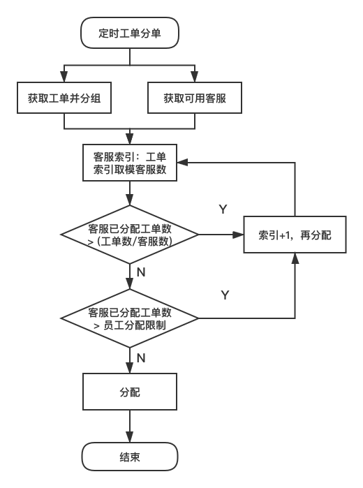

## 定时自动分单功能

### 概括

* 分单对象：待分配的工单
* 分单规则：客服系统配置页面配置
* 分单机制：定时任务

### 具体实现

1. 整体流程图
   
   

2. 分单具体逻辑流程图

   

3. 总结
   
* 因为要求按工单类型平均分配，所以按分单规则查询出待分派的工单后，按应回复时间倒序，把工单按类型分组，一组一组进行分配。
* 分配给客服的方式是平均分配，当前工单索引取模客服数，得到客服的索引，这样分配的弊端是当工单较少时，前排的客服会较多的被分配。如果想避免这种情况，可以选择当要分配的工单小于客服数的时候，随机指派给客服。
  
  
   
