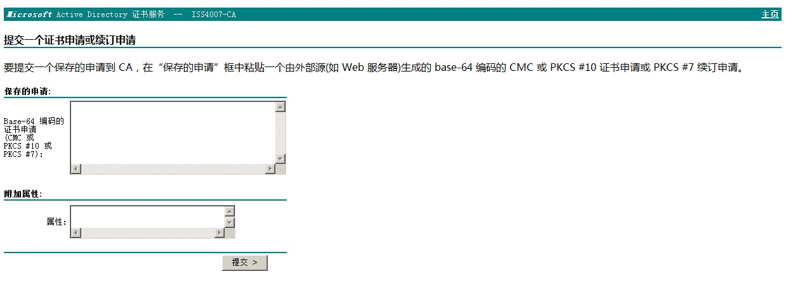
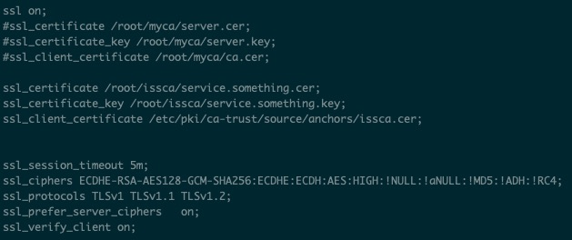
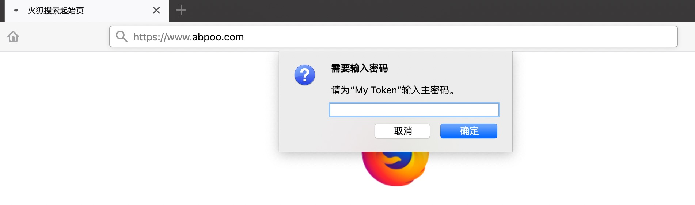
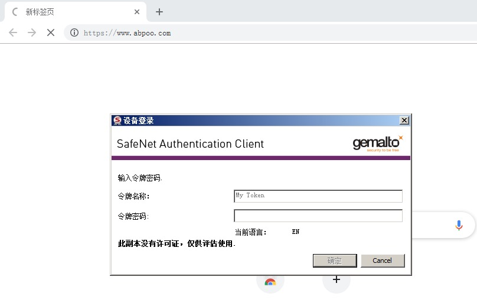
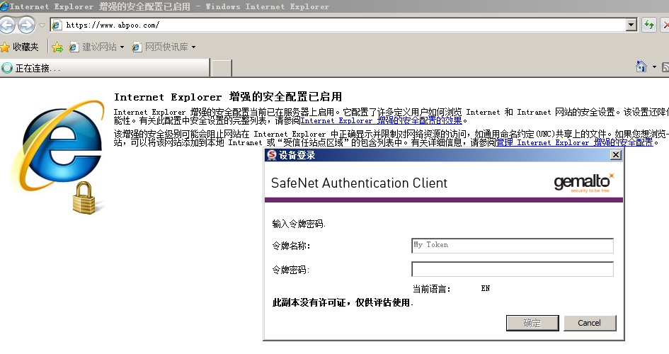

# 使用usb_key实现安全的WEB登录

## 制作证书

1. 虚拟机安装winserver2008 r2
2. 添加角色 Active Directory 证书服务、 Web 服务器(IIS)
3. 导出根证书并将根证书并拷贝到centos服务器,我用的版本 CentOS Linux release 7.4.1708 (Core)
4. 使用openssl命令创建证书申请(服务端证书)

    openssl req -nodes -newkey rsa:1024 -keyout service.something.key -out service.something.csr

5. 在winserver上把service.something.csr里文本到创建证书页面生成证书(服务端)

    

6. 下载Base64编码格式证书并拷贝到centos

7. nginx服务器ssl配置
    
    

8. 使用SAC初始化ukey

9. 创建客户端证书并安装到ukey

## 客户端配置

1. 安装SafeNet Authentication Client
2. Firefox载入PKCS#11模块,载入路径

    Windows  C:\Windows\System32\eTPKCS11.dll

    Mac  /usr/local/lib/libeTPkcs11.dylib

3. IE和Chrome原生支持,在Window上好使,在Mac上有问题,还在想办法解决

4. 插入ukey在浏览器里输入URL访问,就会弹出输入pin密码的对话框,输入就能访问

## 注意事项

1. server证书的Common name必须和nginx域名保持一致
2. 因为自己颁发的证书不受信任,当拔掉ukey再次插入的时候没有弹出PIN密码框,移除信任后重新访问
3. Firefox 载入的PKCS#11库在安装路径里,所以先得安装SAC

## 演示截图

* Firefox 效果图
    

* Chrome 效果图
    

* IE 效果图
    

## 以上详细步骤在下边的文档里

* [产品链接](https://item.jd.com/22214444669.html)

* [SafeNet Authentication Client下载链接](https://support.globalsign.com/customer/portal/articles/1698654)

* [颁发证书参考文档](https://pan.baidu.com/s/1JNTmbWvvfYTkWALwU4_HLw) 提取码: 2ye3 

* [在Linux上设置Windows CA参考文章](https://cbudde.com/microsoft/certificate-services/setting-up-windows-root-ca-on-centos-6-9-linux-server/)
